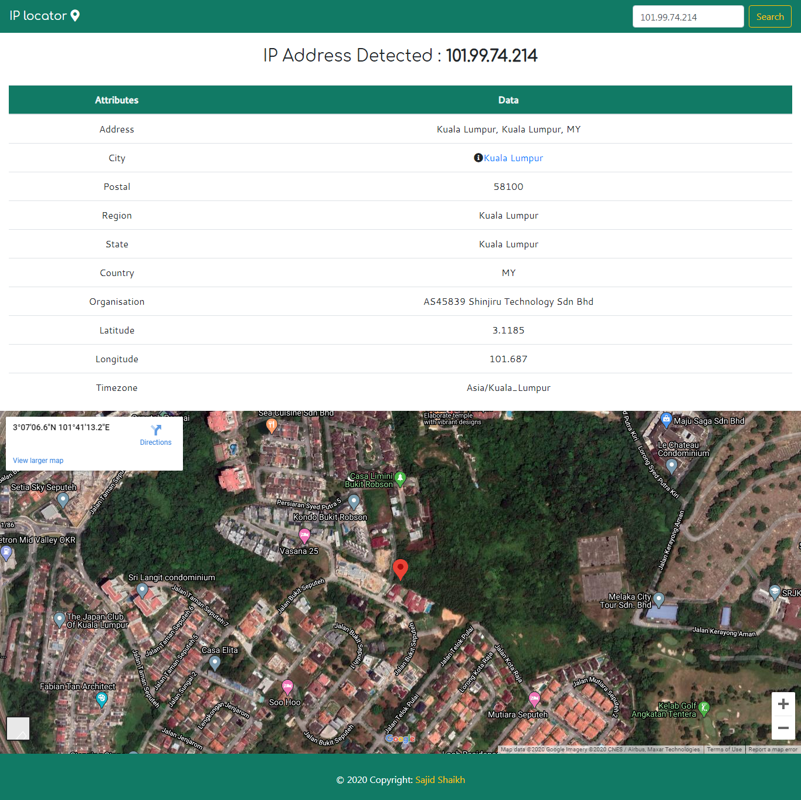

# IP Address Locator
**Search IP Address along with location on Google Map**

# Features
- Finds IP address 
- Provide IP address details with current location which includes Longtitude, latitude,city,country etc.
- Provide location on Google map
- Provide details of the city 

# Technologies
 IP locator use various technologies to work properly.
 [Python](https://www.python.org) - Source language
 
 [Geocoder](https://pypi.org/project/geocoder/) - To Detect IP address
 
 [Wikipedia](https://pypi.org/project/wikipedia/) - To provide city details from wikipedia 
 
 [Django](https://www.djangoproject.com/)   - Backend
 
 [Bootstrap](https://getbootstrap.com/)     - For Responsive UI
 
 [Maps Embed API](https://console.cloud.google.com/marketplace/details/google/maps-embed-backend.googleapis.com)  - For showing location on google map
# LICENSE
**MIT License**